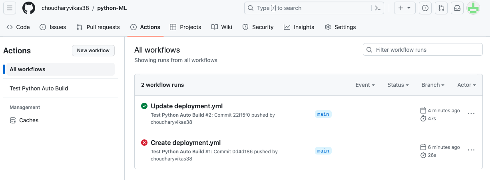
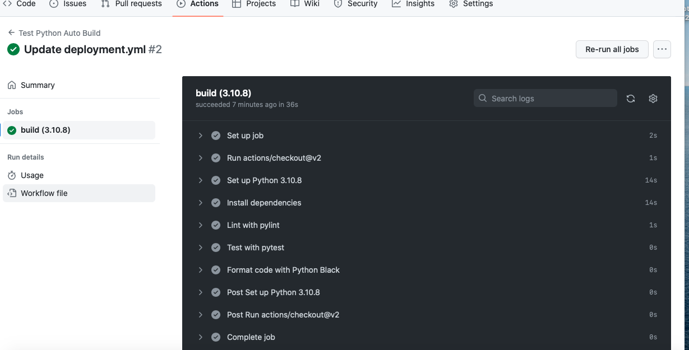

# python-ML

# Setup Terminal
1. which virtualenv
    Ex. @choudharyvikas38 ➜ /workspaces/python-ML (main) $ which virtualenv
        /usr/local/py-utils/bin/virtualenv
2. virtualenv ~/.venv        
3. source ~/.venv/bin/activate
4. which python
5. vim ~/.bashc

# Setup Project and create Makefile & dependencies file
    Command : touch Makefile.  (put all commnad like install, test, lint , format, etc)
    Command : touch dependencies.txt ( To keep all dependecy required for project and install them in one go, you can keep with any name but same name need to pass in Makefile install command)

    # Makefile content
                install:
                    pip install --upgrade pip &&\
                        pip install -r dependencies.txt

                test:
                    python -m pytest -vvv --cov=src test

                format:
                    black *.py

                lint:
                    pylint --disable=R,C *.py

                all: install lint test format

    # Dependecies for this code , you can add as per your requirements
            pytest
            pytest-cov
            pylint
            black
            ipython           

# Create SRC folder and test folder for to keep source code & test cases respectively
    Command : mkdir src
    Command: mkdir tests
    Create First Source file i.e. HelloWorld.py
    Command : touch src/HelloWorld.py

    Create First Test file i.e. test_HelloTest.py
    Command : touch tests/test_HelloTest.py
    Command: make all (to run install, test case ,lint and fomrat )

# to check installed lib version
    better define version with dependecny, you can find verson using below commnad and define version for all required dependecny or lib 
    pip freeze | less

# Finally run commnad 
    command : make all
    Output:
        --------------------------------------------------------------------
        Your code has been rated at 10.00/10 (previous run: 10.00/10, +0.00)

        python -m pytest -v tests
        ================================================== test session starts ==================================================
        platform linux -- Python 3.10.8, pytest-7.4.0, pluggy-1.2.0 -- /home/codespace/.venv/bin/python
        cachedir: .pytest_cache
        rootdir: /workspaces/python-ML
        plugins: cov-4.1.0
        collected 1 item                                                                                                        

        tests/test_HelloWorld.py::test_hello_world PASSED                                                                 [100%]

        =================================================== 1 passed in 0.01s ===================================================
        black src/*.py
        All done! ✨ 🍰 ✨    

# Once everything compile locally and looks good, push your code in your repo
    1. git status
    2. git add *
    3. git commit -m "Python ML intial code for continus integration"
    4. git push 

# Cool now time to setup GitHub Actions for autobuild and deployemnt 
    1. Go to GitHub repo you want to setup
    2. click on Actions then you can select pre defined templates for your workflow or you can setup it manuall.
    3. To setup yourself, click on Setup workflow yourself
    3. copy paste below code in yaml file, or can add/modify commands as per your need. if you can use default file name as main or can change as per your need. In my case i changed it to deployment.yaml

        name: Test Python Auto Build
        on: [push]
        jobs:
        build:
            runs-on: ubuntu-latest
            strategy:
            matrix:
                python-version: [3.10.8]
            steps:
            - uses: actions/checkout@v2
            - name: Set up Python ${{ matrix.python-version }}
                uses: actions/setup-python@v2
                with:
                python-version: ${{ matrix.python-version }}
            - name: Install dependencies
                run: |
                make install
            - name: Lint with pylint
                run: |
                make lint
            - name: Test with pytest
                run: |
                make test
            - name: Format code with Python Black
                run: |
                make format

# on every push in repo , it will insatlled all required lib, will run lint, then will run test cases and formated the code and will deploy....
    

    
Thanks for going through this Article..
